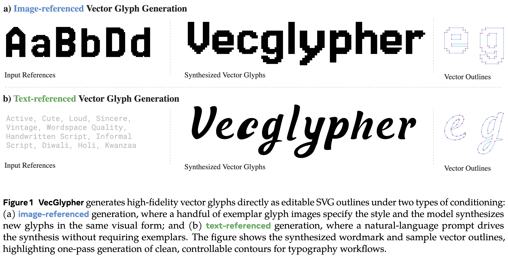
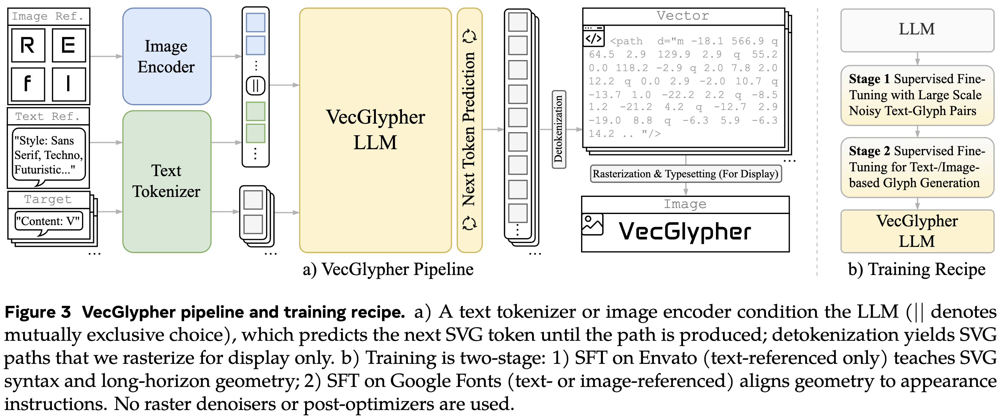

# VecGlypher

[](https://xk-huang.github.io/VecGlypher)
[](https://xk-huang.github.io/VecGlypher/assets/VecGlypher.pdf)
[](https://xk-huang.github.io/VecGlypher)
<!-- [](https://xk-huang.github.io/VecGlypher) -->

This repository contains the implementation and experiments for **VecGlypher: Unified Vector Glyph Generation with Language Models**.

VecGlypher formulates glyph generation as language modeling over SVG path tokens. A single multimodal LLM supports:
- text-referenced glyph generation (style tags/text + target character),
- image-referenced glyph generation (reference glyph images + target character),
- direct one-pass SVG output without raster-to-vector post-processing.

At a high level, the paper shows:
- unified text/image conditioning in one model,
- a two-stage recipe (large noisy Envato continuation, then Google Fonts post-training),
- strong cross-family OOD performance against general LLMs and specialized vector-font baselines,
- strong stability from absolute-coordinate SVG serialization at larger scales.

Key insight on current LLM limits:
- Many general LLMs that can generate generic SVG graphics (for example icons or simple drawings) still struggle to draw valid glyphs and to follow typography style instructions.
- A likely reason is data availability: glyph programs are rarely seen in pretraining corpora because most font data is stored in binary files such as `.ttf` and `.otf`, not as explicit SVG path programs.
- This suggests a practical generalization boundary: strong general SVG/code ability does not automatically transfer to high-fidelity typographic glyph generation without targeted data and training.





This repository includes:
- data curation and dataset building pipelines,
- SFT training configs and launch scripts,
- OpenAI-compatible batch inference tools,
- SVG decoding/rendering/evaluation utilities,
- scripts used for ablations and baseline comparisons.

## Repository Map

- `docs/public/`: user-facing setup/training/inference/eval docs.
- `src/svg_glyph_gen_v2/`: font/glyph processing and dataset construction.
- `src/sft/`: training entry points and config files.
- `src/serve/`: inference clients, decoding, and serving helpers.
- `src/eval/`: OCR/image/point-cloud style evaluation utilities.
- `scripts/data_process/`: end-to-end dataset build scripts.
- `scripts/eval_locally/`: evaluation workflows.

## Quick Start

Recommended read order:
- `docs/public/environment.md`
- `docs/public/data.md`
- `docs/public/training.md`
- `docs/public/inference.md`
- `docs/public/evaluation.md`
- `docs/public/troubleshooting.md`

### 1) Environment

Python 3.11 is recommended.

Train env (LlamaFactory + training stack):
```bash
conda create -n svg_glyph_llm_train -y python=3.11
conda activate svg_glyph_llm_train
pip install uv
uv pip install -r requirements.txt
uv pip install 'llamafactory[torch,metrics,deepspeed,vllm]==0.9.3' vllm==0.8.5.post1
uv pip install --no-cache-dir flash-attn==2.7.2.post1 --no-build-isolation
uv pip install torchmetrics==1.8.1 openai-clip==1.0.1 lpips==0.1.4
```

Eval/inference env (vLLM + metrics stack):
```bash
conda create -n svg_glyph_llm_eval -y python=3.11
conda activate svg_glyph_llm_eval
pip install uv
uv pip install -r requirements.txt
uv pip install transformers==4.57.3 vllm==0.11.0 --torch-backend=cu128
uv pip install flash-attn==2.8.2 --no-build-isolation
uv pip install flashinfer-python==0.3.1.post1
uv pip install torchmetrics==1.8.1 openai-clip==1.0.1 lpips==0.1.4
uv pip install "git+https://github.com/facebookresearch/pytorch3d.git@stable" --no-build-isolation
```

If `libcairo.so.2` is missing:
```bash
conda install -y cairosvg==2.8.2 -c conda-forge
```

### 2) Download Models

```bash
models=(Qwen/Qwen2.5-VL-7B-Instruct
Qwen/Qwen2.5-VL-32B-Instruct
Qwen/Qwen3-4B
Qwen/Qwen3-VL-4B-Instruct
Qwen/Qwen3-VL-8B-Instruct
Qwen/Qwen3-VL-30B-A3B-Instruct
google/gemma-3-27b-it
google/gemma-3-4b-it
meta-llama/Llama-3.3-70B-Instruct
)
for model in ${models[@]}; do
    hf download "$model" --repo-type model --local-dir "saves/$model"
done
```

### 3) Build Data (Example: Google Fonts)

```bash
wget https://github.com/google/fonts/archive/44a3c9a8d8a5b3d6adadedcae000e40e520c55d7.zip -O data/google_fonts.zip
unzip data/google_fonts.zip -d data
mv data/fonts-44a3c9a8d8a5b3d6adadedcae000e40e520c55d7 data/google_fonts
```

Then run processing scripts:
```bash
bash scripts/data_process/250912-build_metadata-google_fonts.sh
bash scripts/data_process/250912-build_dataset-google_fonts-alphanumeric.sh
bash scripts/data_process/250912-build_dataset-google_fonts-alphanumeric-abs_coord.sh
bash scripts/data_process/251023-build_dataset-google_fonts-ref_img.sh
bash scripts/data_process/251028-build_dataset-google_fonts-ref_img-eval_dev_split.sh
```

You can also run tools directly:
```bash
python -m src.svg_glyph_gen_v2.gather_content data/processed/content
python -m src.svg_glyph_gen_v2.batch_render_normalized_svg_v2 --help
python -m src.svg_glyph_gen_v2.build_sft_data_v2 --help
python src/svg_glyph_gen_v2/build_dataset_info.py data/processed/sft/<dataset_name>
```

### 4) Train (SFT)

Edit a config such as `src/sft/configs/train/qwen3_0_6b-full_sft.yaml`:
- `model_name_or_path`
- `dataset_dir` (must contain `dataset_info.json`)
- `output_dir`

Launch:
```bash
llamafactory-cli train src/sft/configs/train/qwen3_0_6b-full_sft.yaml
```

### 5) Inference

Interactive:
```bash
llamafactory-cli chat src/sft/configs/inference/a-z-300_fonts-no_style-qwen3_4b-full_sft.yaml
```

Batch inference with vLLM endpoint:
```bash
vllm serve <model_path> --host 0.0.0.0 --port 30000 -tp 1 -dp 1 --enable-log-requests

python src/serve/api_infer.py \
  --data <jsonl_or_dir> \
  --output_dir outputs/infer \
  --model <model_name_or_path> \
  --base_url http://localhost:30000/v1
```

### 6) Decode + Evaluate

```bash
python -m src.serve.decode_to_svg outputs/infer
python -m src.eval.svg2img_dir outputs/infer_decoded outputs/infer_decoded-img_base64-predict --field predict --width 192 --height 192
python -m src.eval.svg2img_dir outputs/infer_decoded outputs/infer_decoded-img_base64-label --field label --width 192 --height 192
python -m src.eval.score_img_eval outputs/infer_decoded outputs/infer_decoded-img_base64-predict outputs/infer_decoded-img_base64-label outputs/results_img_eval
```

For full eval suite and OCR/point-cloud metrics, see:
- `docs/public/evaluation.md`
- `scripts/eval_locally/eval_suite-template.sh`

## Citation

If you use this codebase, please cite the VecGlypher paper from the project page above.

```
@article{VecGlypher,
  title     = {VecGlypher: Unified Vector Glyph Generation with Language Models},
  author    = {Huang, Xiaoke and Gauri, Bhavul and Ng, Kam Woh and Ng, Tony and Xu, Mengmeng and Liu, Zhiheng and Ren, Weiming and An, Zhaochong and Zhou, Zijian and Qiu, Haonan and Zhou, Yuyin and He, Sen and Wang, Ziheng and Xiang, Tao and Han, Xiao},
  journal   = {arXiv preprint arXiv},
  year      = {2026}
}
```
